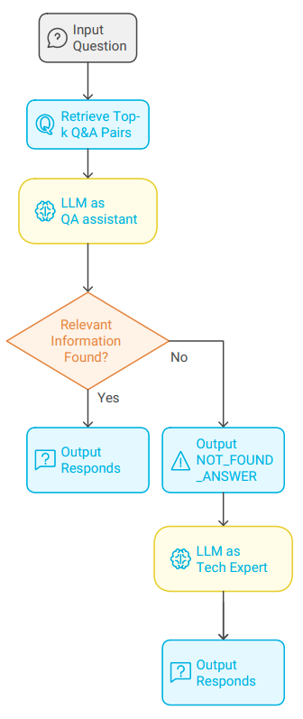
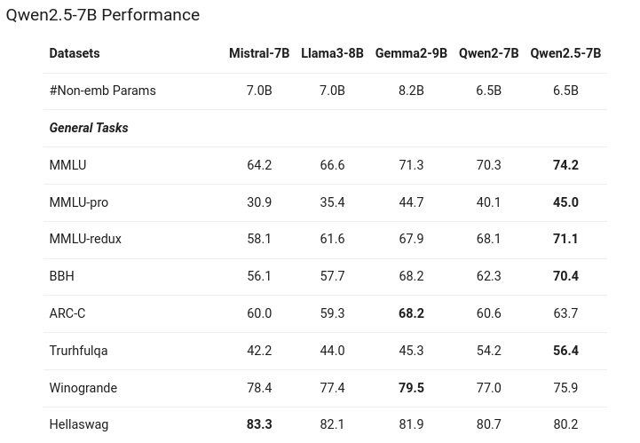

# Trustii's Secure Offline RAG System
***[UPDATE December 2024]: I got top-5 in final result and top-2 in private leaderboard***
## Introduction
This competition aims to build a flexible local retrieval-augumented-generation (RAG) system: Develop a RAG system that generates embeddings using an open-source LLM, the system must support local execution without relying on external API calls. The system should be flexible and capable of handling various types of text data, including but not limited to Q&A datasets, websites, code snippets, documentation, and more.

## Dataset
The data is provided by Understand.Tech AI platform, includes training and test file. The training file comprises 2424 question and answer pairs related to technologies, the test file includes 1040 questions. Our task is to predict answers for these test questions.


## Solution
My solution derived from the idea that LLM can plays different roles: a question answering system or a tech expert.

<div style="text-align:center"></div>

There are three stages:
1. Initially, a straightforward RAG system is employed to retrieve the top-k question and answer pairs relevant to the provided input question, utilizing a pre-trained embedding model sourced from Sentence Transformers. 


2. Subsequently, the input question along with the retrieved pairs are passed to a prompt, which then be input for the LLM. The LLM is tasked with responding to the question based on contextual information, or indicating "NOT_FOUND_ANSWER" if appropriate information cannot be located.


3. Third, LLM’s role is a tech expert, it will tackle remaining hard questions based on retrieved pairs.

<div style="text-align:center"></div>

## RAG tools and models
- LLM: `qwen2.5` (7B)
- Embedding Model: any possible models from Sentence Transformers, currently using `all-MiniLM-L6-v2`
- Vector Database: Faiss
- Serving framework: Ollama
- Pipeline framework: LangChain


### Large Language Model
Qwen2.5 is the latest large language model in Qwen series from Alibaba, it has demonstrated state-of-the-art performance across a variety of tasks, including QnA and Coding tasks, outperforming models of similar size. It also support a wide range of languages, making it a versatile tool for multilingual applications.
<div style="text-align:center"></div>

In this context of the competition, I used 7B version Qwen2.5 for ease of deployment in single local GPU.

### Embedding model
There can be many choices of open-source text embedding models with suitable sizes:
- `all-MiniLM-L6-v2` (English only) and [other models](https://www.sbert.net/docs/sentence_transformer/pretrained_models.html) from Sentence Transformers
- `nomic-embed-text` (English only)
- `mixedbread-ai/mxbai-embed-large-v1` (English)
- `intfloat/multilingual-e5-base` (Multilingual)
- `jinaai/jina-embeddings-v3` (Multilingual)
- ...

I chose `all-MiniLM-L6-v2` since it is widely used in RAG applications and is enough for this English dataset. We don't need other advanced models since it is easy to find relevant contexts in this given dataset.
If you need French support, `intfloat/multilingual-e5-base` is a good choice !

I chose `top-k=20`

### Vector Database
As declared in Technical Requirements, Faiss is a must.

### Pipeline framework
I designed inference pipeline using LangChain and LangChain Expression Language (LCEL).

### Serving framework
Ollama is a popular framework known for its simplicity in deploying language models efficiently. With just one line of code, you can easily serve a model.
Other options could be vLLM, LiteLLM, TGI, TensorRT-LLM. All these tools have been effectively integrated with LangChain.

## Implementation details
Full pipeline is implemented in `flow_langchain_full.py`.

### Folder structure
```commandline
├── api.py
├── baseline.py
├── baseline_with_pairs.py
├── config.py
├── data
│   ├── test.csv
│   └── train.csv
├── docker-compose.yml
├── Dockerfile
├── entrypoint.sh
├── flow_langchain_full.py
├── gunicorn.conf.py
├── image
│   ├── img_diagram.png
│   ├── img_qwen_benchmark.png
│   └── img_rag.png
├── ollama
│   └── ollama
├── README.md
├── requirements.txt
├── saved_dir_db_faiss
│   ├── faiss_pair_collection.faiss
│   └── faiss_pair_collection.pkl
└── submission
    ├── submission_baseline.csv
    ├── submission_langchain_full.csv
    └── submission_pair.csv

```
- `data`: dataset of the competition
- `saved_dir_db_faiss` is database folder, which saved faiss vectors generated from embedding model.
- `submission`: submission folder, `submission/submission_langchain_full.csv` is final submission file.
- `baseline.py` and `baseline_with_pairs.py`: My baselines, LLM as QA Assistant only.
- `flow_langchain_full.py`: Full pipeline
- `Dockerfile`, `docker-compose.yml`, `gunicorn.conf.py`, `api.py` and `entrypoint.sh` are files for building service
- `ollama`: saved ollama folder

### Setup
To install, run `pip install -r requirements.txt`

### Inference test dataset
To fully run test data, run `python flow_langchain_full.py`, it will output `submission/submission_langchain_full.csv` file.

### Run service without docker
To run service, run `python api.py`, remember start ollama server first and download ollama models.

### Run service with Docker
To run service, run `sudo docker compose up`

### API
To infer a sentence, run
```
curl --location 'http://0.0.0.0:11436/infer' --header 'Content-Type: application/json' --data '{
  "text": "acronym of SRP"
}'
```
Result as follows:
```
{"success":true,"result":"Secure Real-time Protocol,"}
```

### Hardware
I currently use NVIDIA GeForce GTX 1080 Ti 12GB VRAM.


